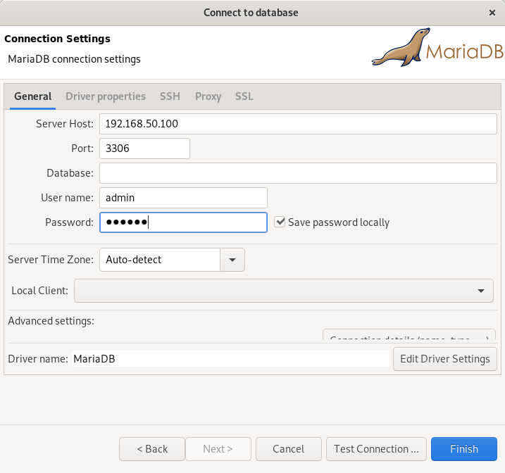
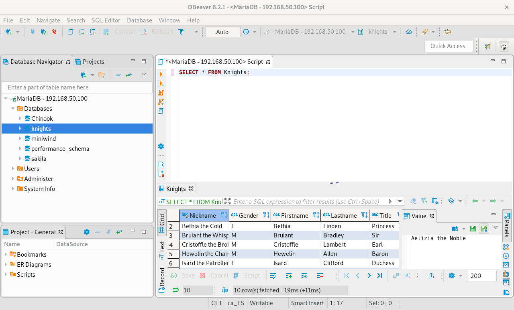
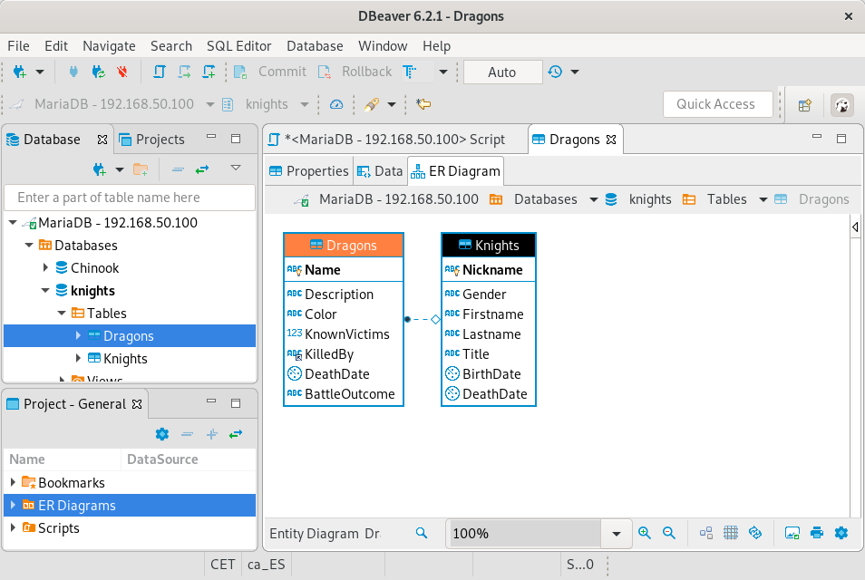

= Activitat: Primeres passes amb MariaDB
:doctype: article
:encoding: utf-8
:lang: ca
:toc: left
:toclevels: 3
:numbered:
:ascii-ids:

== Introducció

En un SGBD habitualment tindrem un programa servidor, que és el que accedeix a
les bases de dades i gestiona les nostres consultes, i un programa client, que
és on els usuaris poden introduir consultes i on visualitzaran els resultats.

En un entorn real, el servidor i el client seran a diferents ordinadors, i
el client es connectarà al servidor utilitzant algun protocol de xarxa
estàndard.

En un entorn de desenvolupament o de proves podem instal·lar el servidor a la
mateixa màquina on tindrem el client, per facilitar-ne la configuració.

En aquest curs tindrem el servidor instal·lat en una màquina virtual dins del
nostre ordinador físic. Això ens evita de tenir un servidor accessible per
internet 24 hores al dia, i a la vegada ens permet que tothom tingui la
mateixa configuració i que el servidor de BD no consumeixi recursos quan no
l'estiguem utilitzant.

La màquina virtual que utilitzarem s'ha creat utilitzant _vagrant_, un sistema
que n'automatitza la creació i configuració. Pots accedir a l'apartat sobre
link:vagrant/readme.adoc[vagrant] per veure com utilitzar-la.

[NOTE]
====
L'apartat d'instal·lació només és necessari si volem instal·lar el servidor
de MariaDB directament, sense utilitzar _vagrant_.
====

== Instal·lació

Hi ha dues opcions per instal·lar el MariaDB en Debian:

1. Instal·lar el paquet inclòs a la distribució.
2. Instal·lar el paquet preparat pels desenvolupadors de MariaDB per a Debian.

=== Primera opció

La *primera opció* és molt senzilla: només cal instal·lar
el paquet `default-mysql-server` des de la línia d'ordres:

[source,bash]
----
$ sudo apt update
$ sudo apt install default-mysql-server
----

=== Segona opció

La *segona opció* és una mica més complexa, perquè cal afegir el repositori de
MariaDB a la configuració.

Seguim les instruccions de
link:https://downloads.mariadb.org/mariadb/repositories/[la pàgina oficial de MariaDB]:

1. Seleccionem la nostra distribució (Debian).
2. Seleccionem la nostra versió (Buster).
3. Seleccionem la versió de MariaDB que volem (10.4).
4. A continuació ens apareixeran les línies que hem d'executar al nostre
sistema:
+
[source,bash]
----
sudo apt-get install software-properties-common dirmngr
sudo apt-key adv --fetch-keys 'https://mariadb.org/mariadb_release_signing_key.asc'
sudo add-apt-repository 'deb [arch=amd64] https://mariadb.mirror.pcextreme.nl/repo/10.5/debian buster main'
sudo apt-get update
sudo apt-get install mariadb-server
----

== Ús del MariaDB

=== Establir una connexió

Un cop instal·lat el servidor, només l'usuari administrador del sistema
operatiu (_root_) podrà connectar-s'hi, i només des de la mateixa màquina on
hem instal·lat el servidor.

Per establir una connexió amb aquest usuari farem:

[source,bash]
----
$ sudo mysql
----

[NOTE]
====
La màquina _vagrant_ ja ve amb un altre usuari creat que es pot connectar
remotament i un conjunt de bases de dades importades.
====

=== Gestió bàsica del servidor

[NOTE]
====
Noteu que el programa `mysql` que estem invocant per iniciar una sessió és el
programa client que ens permet introduir ordres al servidor de MariaDB. El
servidor, que internament té de nom `mysqld`, s'arrenca automàticament quan
engeguem l'ordinador.
====

Un cop instal·lat el servidor podem comprovar que s'està executant amb:

[source,bash]
----
$ sudo systemctl status mysql
● mysql.service - LSB: Start and stop the mysql database server daemon
   Loaded: loaded (/etc/init.d/mysql)
   Active: active (running) since dt 2016-09-20 10:38:14 CEST; 8min ago
  Process: 711 ExecStart=/etc/init.d/mysql start (code=exited, status=0/SUCCESS)
   CGroup: /system.slice/mysql.service
           ├─820 /bin/bash /usr/bin/mysqld_safe
           ├─821 logger -p daemon.err -t /etc/init.d/mysql -i
           ├─974 /usr/sbin/mysqld --basedir=/usr --datadir=/var/lib/mysql --p...
           └─975 logger -t mysqld -p daemon.error
----

Tenim les següents operacions bàsiques:

- Parar el servidor: `sudo systemctl stop mysql`.
- Arrencar el servidor: `sudo systemctl start mysql`.
- Reiniciar el servidor: `sudo systemctl restart mysql`.
- Fer que el servidor no arrenqui per defecte quan engeguem l'ordinador:
`sudo systemctl disable mysql`.
- Fer que el servidor torni a arrencar per defecte: `sudo systemctl enable mysql`.

=== Importació d'una base de dades

Per començar a treballar amb l'SQL podem fer-ho amb la base de dades d'exemple
sobre link:db/mariadb/lastnames.sql[cognoms catalans]. Cal baixar aquest fitxer
en local i importar-lo a MariaDB.

Si esteu treballant des de la web del GitLab podeu baixar-vos el fitxer clicant
amb el botó dret sobre _download it_ i indicant que voleu guardar el fitxer.

Suposem que l'hem guardat a _Baixades_. Si el meu usuari és _joan_, la ruta
completa a aquest fitxer serà `/home/joan/Baixades/lastnames.sql`.

Per importar la base de dades seguim els següents passos:

[source,bash]
----
$ cd Baixades
$ mysql -u root -p
Enter password:
Welcome to the MariaDB monitor.  Commands end with ; or \g.
Your MariaDB connection id is 44
Server version: 10.0.27-MariaDB-0+deb8u1 (Debian)

Copyright (c) 2000, 2016, Oracle, MariaDB Corporation Ab and others.

Type 'help;' or '\h' for help. Type '\c' to clear the current input statement.

MariaDB [(none)]> source lastnames.sql;
Query OK, 0 rows affected (0.00 sec)
[...]

Query OK, 29980 rows affected (2.73 sec)
Records: 29980  Duplicates: 0  Warnings: 0

Query OK, 11972 rows affected (0.22 sec)
Records: 11972  Duplicates: 0  Warnings: 0
[...]
----

L'ordre `source` permet executar un script SQL guardat a un fitxer.

[NOTE]
====
Alguns scripts no incorporen les sentències de creació i ús de la base de dades.
En aquests casos cal afegir les sentències `create database <nom>` i
`use <nom>` abans de `source`.
====

=== Creació d'un usuari no administrador

Un cop hem creat una base de dades ja no voldrem treballar amb l'usuari root.

El que farem serà crear un usuari que tingui tots els permisos sobre la base
de dades que hem creat, però que no pugui realitzar tasques administratives.

Això ens evita el risc de cometre errades i fer malbé el sistema.

Per crear aquest usuari executarem les dues comandes següents:

[source,sql]
----
MariaDB [lastnames]> create user 'joan'@'localhost' identified by '12345';
MariaDB [lastnames]> grant all on lastnames.* to 'joan'@'localhost';
----

El que hem fet és, a la primera ordre, crear l'usuari de nom `joan`, que
només es pot connectar des del mateix ordinador (`localhost`) i que té com a
contrasenya `12345`. A la segona ordre hem dit que aquest usuari tindrà tots els
permisos sobre totes les taules de la base de dades `lastnames`.

Finalment, ja podem tancar la sessió al `mysql`:

[source,sql]
----
MariaDB [lastnames]> exit;
----

== Connexió al servidor en línia d'ordres

Per connectar amb el servidor amb el nostre usuari habitual (no administrador)
utilitzarem l'ordre següent:

[source,bash]
----
$ mysql -u joan -p
----

L'opció *-u* permet indicar amb quin usuari connectem, i l'opció *-p* indica
que utilitzarem una contrasenya per autenticar-nos en el servidor.

A continuació es presenten algunes ordres bàsiques per moure-ns en el sistema.

- `show databases;`: mostra una llista amb totes les bases de dades disponibles
al servidor. Com a mínim trobarem les bases de dades _mysql_ (on es guarda la
informació de tots els usuaris i permisos del servidor), _information_schema_
i _performance_schema_.

- `use <base de dades>;`: passem a utilitzar una de les bases de dades que hi
ha en el SGBD.

- `show tables;`: un cop estem utilitzant una base de dades concreta, amb
aquesta ordre podrem veure totes les taules que hi ha en aquesta BD.

- `desc <taula>;`: amb aquesta ordre podem veure l'estructura d'una de les
taules: quines columnes té i de quin tipus són, entre d'altres propietats.

- `select * from <taula>;`: aquesta és la primera sentència pròpiament SQL que
executem. Mostrarà el contingut complet de la taula que indiquem.

- `exit`: amb _exit_ o amb Ctrl+D tanquem la connexió al servidor.

Cal tenir en compte que la major part d'ordres han d'acabar en punt i coma. Si
no es posa, el sistema pensarà que encara no hem escrit l'ordre sencera, ja que
és habitual que les ordres SQL ocupin més d'una línia. Llavors, tenim prou amb
escriure el punt i coma que ens hem deixat a la línia següent per poder
continuar:

[source,sql]
----
MariaDB [mysql]> select * from user
    -> ;
----

== Connexió al servidor des de l'entorn gràfic

Per connectar-nos gràficament al servidor de MariaDB podem utilitzar un
dels múltiples programes clients disponibles, per exemple, el DBeaver o
l'OmniDB.

link:https://dbeaver.io/download/[Descarreguem el DBeasver] pel nostre
sistema operatiu. Per Debian hem de seleccionar el fitxer
`Linux Debian package 64 bit (installer)`.

Un cop baixat el fitxer, obrim una línia d'ordres a la mateixa carpeta, i
executem:

```
$ sudo apt update
$ sudo dpkg -i dbeaver-ce_6.2.1_amd64.deb
$ sudo apt -f install
```

El DBeaver és un client gràfic que podem utilitzar per diversos SGBD com
MariaDB o PostgreSQL. Ens permet configurar diverses connexions i recordar-les
per més endavant.

Per afegir una connexió haurem d'especificar a quin sistema ens hem de connectar,
la IP on es troba el servidor, l'usuari que utilitzarem i la contrasenya:



Un cop hem connectat podem veure a l'esquerra totes les bases de dades que hi
ha al servidor.

Podem indicar que treballarem amb una d'elles clicant amb el botó dret i
seleccionant `set active`.

Podem obrir un editor de sentències SQL seleccionant al menú `SQL Editor` o
prement F3. Aquí podem escriure consultes SQL i executar-les amb el botó
de _play_ o prement _Ctrl+Intro_:



Qualsevol de les ordres SQL o de gestió que veurem a continuació es poden
utilitzar al DBeaver.

El DBeaver també ens permet veure l'estructura d'una base de dades. Clicant
amb el botó dret en una taula a l'esquema de l'esquerra, o seleccionant l'opció
`Create new ER Diagram` podem obtenir una representació gràfica de totes les
taules, els seus atributs, i les relacions que hi ha entre elles:



== Primeres sentències SQL

Amb una primera base de dades funcional, ja podem començar a realitzar les
nostres primeres consultes.

Aquesta base de dades conté una única taula, anomenada _LastNames_. Aquesta
taula conté informació sobre la freqüència d'aparició dels diferents cognoms
en la població de Catalunya el 2014.

Les seves columnes són les següents:

- `LastNameId`: un identificador únic per cada cognom que, a més, ens indica la
posició relativa del cognom a la llista. Com més baix, més freqüent és el
cognom.
- `Name`: el cognom en sí.
- `Freq1`: la quantitat de persones que tenen aquest cognom com a primer cognom.
- `Freq1PerThousand`: sobre mil persones, quantes persones tindrien aquest
cognom com a primer cognom.
- `Freq2`: com _Freq1_ però pel segon cognom.
- `Freq2PerThousand`: com _Freq1PerThousand_ però pel segon cognom.

Algunes sentències que podem provar:

- Veure la informació sobre 10 cognoms qualsevols (en aquest cas surten
ordenats, però la sentència en general no ho està garantint):
+
[source,sql]
----
SELECT * FROM LastNames LIMIT 10;
----

- Veure la informació sobre un cognom concret:
+
[source,sql]
----
SELECT * FROM LastNames WHERE Nom="Puig";
----

- Veure la informació dels cognoms pels qual hi ha més de 20000 persones que el
tenen com a primer cognom:
+
[source,sql]
----
SELECT * FROM LastNames WHERE Freq1>20000;
----
